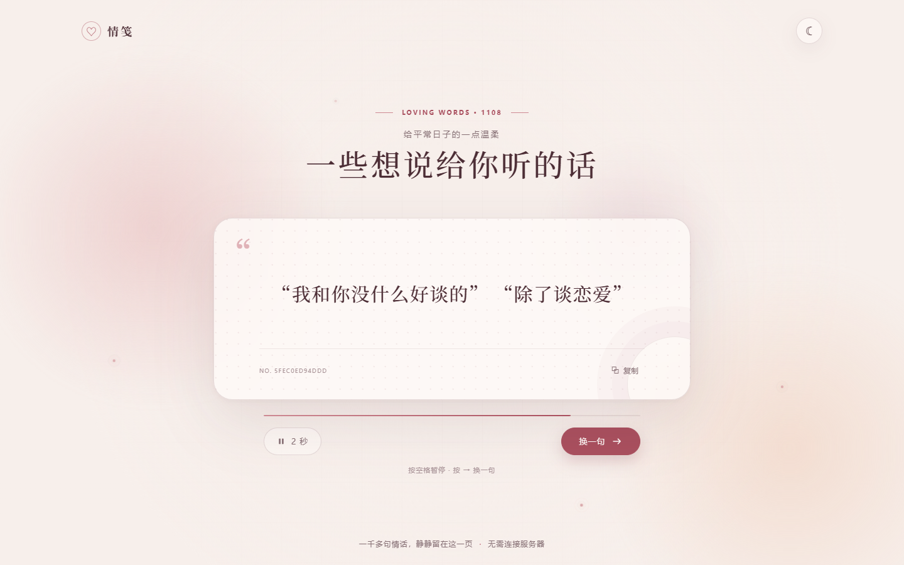

# 情笺 · Love Story Platform

一个温暖、克制的单页情话展示站，以及一个完全独立、无数据库的随机情话 API。

前端和后端都会在构建时打包同一份公开数据，但运行时互不通信：前端不会请求 API，也不会包含任何 API Key。你可以只部署前端、只部署 API，或者分别部署两者。

## 页面预览



## 项目结构

```text
apps/
  web/                  Vue 3 + Vite 单页展示站
  api/                  Hono 无状态 API
packages/
  dataset/              前后端共享的生成数据包
  shared/               API 响应类型
data/
  love-lines.txt        清洗后的规范数据
scripts/
  prepare-data.mjs      可复现的数据清洗与生成脚本
infra/docker/           独立 Web/API 镜像
```

## 本地开发

需要 Node.js 20.19+ 和 pnpm 10。

先进入仓库根目录（即包含 `pnpm-workspace.yaml` 的目录）。依赖只需在根目录安装一次。下列命令均在该目录下执行：

```bash
corepack enable
pnpm install
pnpm prepare:data
pnpm dev:web
```

API 默认要求鉴权。复制示例配置并换成高熵随机 Key：

```bash
cp apps/api/.env.example apps/api/.env
pnpm generate:api-key
pnpm dev:api
```

将 `pnpm generate:api-key` 输出的 Key 填入 `apps/api/.env` 的 `API_KEYS`。该命令使用加密安全随机数生成 256 位 Key。

这里虽然从仓库根目录执行 `pnpm dev:api`，API 读取的仍是 `apps/api/.env`：根目录脚本只是将命令转发给 workspace 中的 `@love-story/api`，而 Node.js 入口会按自身文件位置明确加载 `apps/api/.env`，不依赖当前工作目录。

项目中的环境文件用途如下：

| 文件 | 使用者 | 用途 |
| --- | --- | --- |
| `apps/api/.env` | API 的 Node.js 入口（`pnpm dev:api` 或 `pnpm --filter @love-story/api dev`） | 本地 Node API 的鉴权 Key、端口等配置 |
| `apps/api/.dev.vars` | Wrangler（`pnpm --filter @love-story/api dev:worker`） | 本地模拟 Cloudflare Worker 时的变量；从 `.dev.vars.example` 复制 |
| 根目录 `.env` | Docker Compose | Compose 的端口和传给 API 容器的环境变量；不会被本地 Node API 自动读取 |

`apps/api/package.json` 是 pnpm workspace 子包的配置，所以也可以在 API 目录内启动：

```bash
cd apps/api
pnpm dev
```

它与在仓库根目录执行 `pnpm dev:api` 启动的是同一个 Node API。通常建议统一在根目录执行项目级脚本，减少在多个目录之间切换；子包脚本主要用于单独开发或部署该应用。

```bash
curl http://localhost:3000/v1/love-lines/random \
  -H "Authorization: Bearer lk_live_your_key"
```

显式允许匿名调用：

```env
AUTH_MODE=disabled
```

`AUTH_MODE` 未设置时等同于 `required`。当鉴权开启但没有配置 Key 时，API 会失败关闭并返回 `503`，不会自动切换为匿名模式。

## 构建与验证

```bash
pnpm test
pnpm typecheck
pnpm build
```

前端产物位于 `apps/web/dist`，API 的 Node.js 产物位于 `apps/api/dist`。

## 部署矩阵

| 目标 | Web | API | 推荐方式 |
| --- | --- | --- | --- |
| Cloudflare | Pages | Workers | 建立两个独立项目 |
| GitHub | Pages | 不支持 | 仅部署静态站 |
| Vercel | Static/Vite | Functions | 建立两个独立项目 |
| Docker | Nginx | Node.js | 按需启动一个或两个服务 |

### Cloudflare Pages

- Repository root：仓库根目录
- Build command：`pnpm build:web`
- Output directory：`apps/web/dist`

API 使用 `apps/api/wrangler.jsonc`：

```bash
pnpm --filter @love-story/api exec wrangler secret put API_KEYS
pnpm --filter @love-story/api deploy:cloudflare
```

若希望匿名访问，将普通变量 `AUTH_MODE` 显式设置为 `disabled`。

### GitHub Pages

启用仓库的 **Settings → Pages → GitHub Actions**。内置的 `pages.yml` 会构建并发布前端。页面采用相对资源路径，可以同时适配用户域名、项目子路径和自定义域名。

### Vercel

从同一仓库创建两个项目：

- Web 项目 Root Directory：`apps/web`
- API 项目 Root Directory：`apps/api`

Web 使用 Vite 默认构建设置。API 项目为 Hono 默认导出，配置 `AUTH_MODE` 和 `API_KEYS` 环境变量即可。

### Docker

需要先安装并启动 Docker Desktop。Windows 用户应使用 Linux containers，并等待 Docker Engine 完全启动；运行 `docker info` 能正常显示 Server 信息后，再执行下面的 Compose 命令。如果出现 `dockerDesktopLinuxEngine` 管道不存在的错误，说明 Docker Desktop 或 Linux Engine 尚未运行。

在仓库根目录复制 Docker Compose 示例配置，并将生成的 Key 填入根目录 `.env` 的 `API_KEYS`。这个 `.env` 只供 Compose 使用，与本地开发所用的 `apps/api/.env` 相互独立：

```bash
cp .env.example .env
pnpm generate:api-key
```

以下三个启动命令**不需要全部执行**，根据需要选择一个：

```bash
# 只启动 Web 前端，访问 http://localhost:18080
docker compose up --build web

# 只启动 API，访问 http://localhost:3000
docker compose up --build api

# 同时启动 Web 和 API
docker compose up --build
```

`--build` 会在启动前构建或重新构建镜像。上述命令默认在前台运行，按 `Ctrl+C` 停止；如需后台运行，可添加 `-d`，例如 `docker compose up --build -d`。

- Web 默认：<http://localhost:18080>
- API 默认：<http://localhost:3000>

Web 默认使用较少与本地开发服务及 Windows 保留端口冲突的 `18080`。如需更换，在 `.env` 中修改 `WEB_PORT`。

`web` 与 `api` 是相互独立的服务：只启动其中一个不会隐式启动另一个，前端也不会请求该 API。

## API

```http
GET /v1/love-lines/random
Authorization: Bearer lk_live_xxx
```

```json
{
  "id": "line_10d327dbe599",
  "text": "-不许哭不许哭 -不许流那些小珍珠",
  "datasetVersion": "989e785d0611"
}
```

支持以逗号分隔的多个 Key，方便轮换：

```env
API_KEYS=lk_live_new,lk_live_previous
```

Docker/Node.js 入口还支持 `API_KEYS_FILE=/run/secrets/api_keys`。

## 数据与许可

项目代码使用 MIT License。初始数据来源、清洗方式、原文件校验和与第三方权利说明见 [DATA-NOTICE.md](DATA-NOTICE.md) 和 [NOTICE.md](NOTICE.md)。上游许可证原文保存在 `third_party/yduke-love/LICENSE`。
